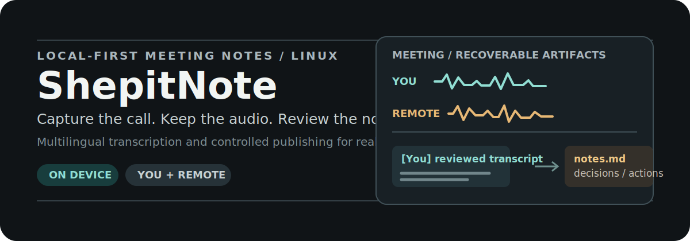
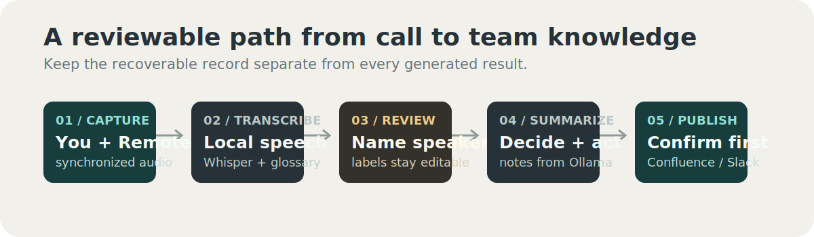

# ShepitNote

<p align="center">
  
</p>

**Private, local-first meeting notes for Linux teams that work across Ukrainian, Russian, and English.**

ShepitNote captures the meeting audio you need, keeps it for recovery, transcribes and attributes it, then produces structured notes you can review before optionally publishing to Confluence and Slack. By default, audio and text stay on your machine: faster-whisper transcribes and Ollama summarizes.

> An explicit [cloud mode](docs/CLOUD.md) is available when a meeting is suitable for off-device processing. Uploading is always opt-in.

## The Meeting Record You Can Revisit

<p align="center">
  
</p>

ShepitNote is built around a simple rule: **audio is the source of truth.** The recording remains available, so you can reprocess the same meeting with a different language, Whisper model, glossary, speaker labels, or summary model without recording it again.

For calls, its recommended `dual` capture mode records your microphone as **You** and the system audio as **Remote** in synchronized tracks. That provides a dependable source-level split before any speaker inference. Optional remote-only diarization can then separate people on the far side; guided labels and a participant roster turn those labels into readable names.

## Why ShepitNote

| Need | How ShepitNote handles it |
| --- | --- |
| Know who said what | Separate `You` / `Remote` tracks first; optionally diarize only the remote track and review labels. |
| Preserve a difficult call | Keep original meeting audio and complete per-meeting artifacts for retry and inspection. |
| Work across uk / ru / en | Choose a language per meeting, bias technical terms with hotwords, and normalize terminology with a glossary. |
| Keep notes private | Run transcription, diarization, and summarization locally by default. |
| Publish carefully | Review titles, transcript, summary, and each configured Confluence or Slack target before sending. |

It is deliberately a meeting workflow, not a lightweight push-to-talk dictation tool. If you only need simple English dictation, upstream [hushnote](https://github.com/peteonrails/hushnote) or [Voxtype](https://github.com/peteonrails/voxtype) may be a better fit.

## Quick Start

Install the system packages for your distribution, create the Python environment, install a local Ollama model, then run the guided flow:

```bash
git clone https://github.com/yuriytkach/shepitnote.git
cd shepitnote

# Debian / Ubuntu / KDE neon; package names vary by distribution.
sudo apt install ffmpeg pipewire-pulse python3-venv
./setup.sh

# Install Ollama, then choose a local instruction-tuned model.
curl -fsSL https://ollama.com/install.sh | sh
ollama pull llama3.1:8b

./shepitnote meeting
```

The guided flow records, processes the meeting, lets you review its output, and asks before publishing anything. Full first-run instructions and CPU-friendly settings are in [Setup](docs/SETUP.md).

### Recommended Call Setup

Use dual-track capture for calls. If you use open speakers rather than a headset, enable echo cancellation before joining:

```bash
./shepitnote aec on
AUDIO_SOURCE_TYPE=dual ./shepitnote meeting
```

`You` comes from your microphone; `Remote` comes from the default audio-output monitor. This works with calls played through Zoom, Slack, Google Meet, Discord, or a browser. See [Audio capture](docs/AUDIO.md) for routing, Bluetooth, echo cancellation, and the generated files.

## A Practical Workflow

```bash
# Record now; process later.
./shepitnote record
./shepitnote process-last

# Rebuild a retained meeting with a chosen language or summary model.
./shepitnote process-meeting 20260720_190326 -l uk -o another-model
```

Each meeting gets its own directory under `recordings/YYYYMMDD/`. It retains source WAV or MP3 tracks, transcription JSON, speaker-label data, final transcript, summary, metadata, and publishing markers. `status` and `catchup` identify incomplete work and resume it safely.

## Multilingual Meetings

ShepitNote is tuned for Ukrainian, Russian, and English engineering calls, including English technical vocabulary in Cyrillic speech. Use `-l uk`, `-l ru`, or `-l en` when a meeting has a dominant language; add `--hotwords`, `--initial-prompt`, and glossary rules for terminology.

**Current limitation:** Whisper detects one language near the start of each track. Automatic detection therefore chooses one language for the full file and can be unreliable for a meeting that regularly switches languages. Choose the dominant language when possible; [chunk-level constrained selection is planned](https://github.com/yuriytkach/shepitnote/issues/15). Read [language and accuracy guidance](docs/LANGUAGE.md) before relying on `auto` for mixed meetings.

## What It Includes

- Dual-track and mixed recording modes for PipeWire or PulseAudio.
- Real-time WebRTC echo cancellation for open-speaker calls.
- CPU-first faster-whisper transcription with model, language, prompt, and hotword controls.
- Optional local pyannote remote-track diarization, speaker labeling, roster support, and relabeling.
- Ollama summaries with discussion notes, decisions, and action items.
- Confirm-gated Confluence publishing and a separate concise Slack update.
- `status`, `catchup`, and complete-meeting reprocessing for recoverable operations.
- Explicit cloud transcription and/or summarization for non-sensitive meetings.

## Commands

```text
record              Start recording (stop with Ctrl+C)
meeting             Guided record, review, and confirm-publish flow
process-last        Process the most recent recording
process-meeting ID  Reprocess a complete retained meeting
diarize FILE        Identify speakers in an audio file
label FILE          Label speakers interactively
relabel ID          Revisit speaker names for an existing meeting
status              Show pending, partial, and completed recordings
catchup             Resume unfinished recordings and hooks
aec on|off|status   Control real-time echo cancellation
```

Run `./shepitnote help` for the full command and option reference in your checkout.

## Documentation

- [Setup](docs/SETUP.md): installation, first-run test, and CPU limits.
- [Audio](docs/AUDIO.md): capture modes, dual tracks, AEC, routing, and output files.
- [Language](docs/LANGUAGE.md): Whisper models, uk/ru/en behavior, hotwords, and glossary rules.
- [Diarization](docs/DIARIZATION.md): speaker splitting, labeling, and review.
- [Publishing](docs/PUBLISHING.md): hooks, Confluence, Slack, and the confirm-gated flow.
- [Cloud mode](docs/CLOUD.md): providers, privacy, configuration, and cost.
- [Project direction](docs/PROJECT_DIRECTION.md): product boundary, architecture, and roadmap.
- [Contributing](CONTRIBUTING.md): development setup and contribution guidelines.

## Credits And License

MIT. See [LICENSE](LICENSE).

ShepitNote is a fork of [hushnote](https://github.com/peteonrails/hushnote) by [Peter Jackson](https://github.com/peteonrails), retaining the original copyright. It extends the original recording-to-summary pipeline with dual-track You/Remote capture, WebRTC echo cancellation, multilingual meeting handling, terminology normalization, speaker review, recoverable reprocessing, controlled publishing, and a guided meeting flow.

Built with [faster-whisper](https://github.com/SYSTRAN/faster-whisper), [Ollama](https://ollama.com), [pyannote.audio](https://github.com/pyannote/pyannote-audio), and [ffmpeg](https://ffmpeg.org).
